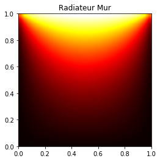

# Resolution-de-systemes-lineaires-equation-de-la-chaleur

Le but de ce projet consiste à implémenter des algorithmes derésolution de systèmes linéaires de grande taille, et à les appliquer à un problème de résolution d’équation aux dérivées partielles. Dans ce devoir, on considère uniquement des systèmes linéaires symétriques, définis positifs et creux (ne comportant que relativement peu d’éléments non nuls), et on exploite ces trois propriétés pour obtenir des algorithmes plus efficaces.

la première partie s’intéresse à une méthode de factorisation de matrice symétrique appelée décomposition de Cholesky;

la seconde partie construit un algorithme appelé « méthode du gradient conjugué » pour résoudre un système linéaire.

enfin, la dernière partie utilise les algorithmes définis dans les deux premières parties afin de résoudre une équation aux dérivées partielles, l’équation de la chaleur.

