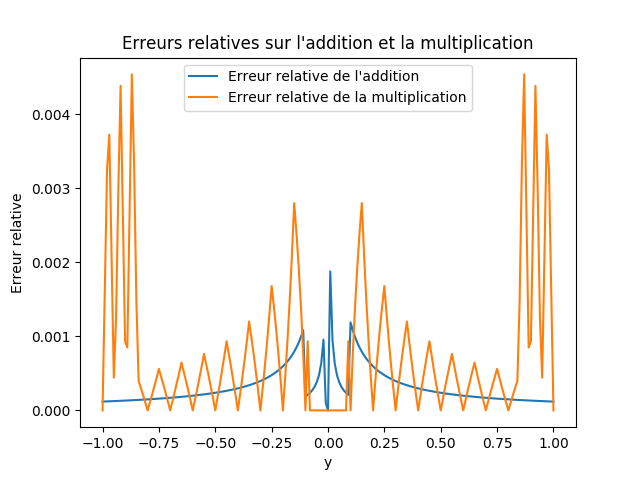

# Methodes-de-calcul-numerique

Le but de ce projet consiste à évaluer les problèmes qui peuvent apparaître lors de l’utilisation d’opérations élémentaires, voire d’algorithmes plus poussés, sur des nombres flottants.

la première partie s’intéresse à trouver des exemples dans lesquels les opérations élémentaires sont insuffisamment précises;
la seconde partie donne des exemples d’algorithmes utilisés dans des conditions de calcul en basse précision.

